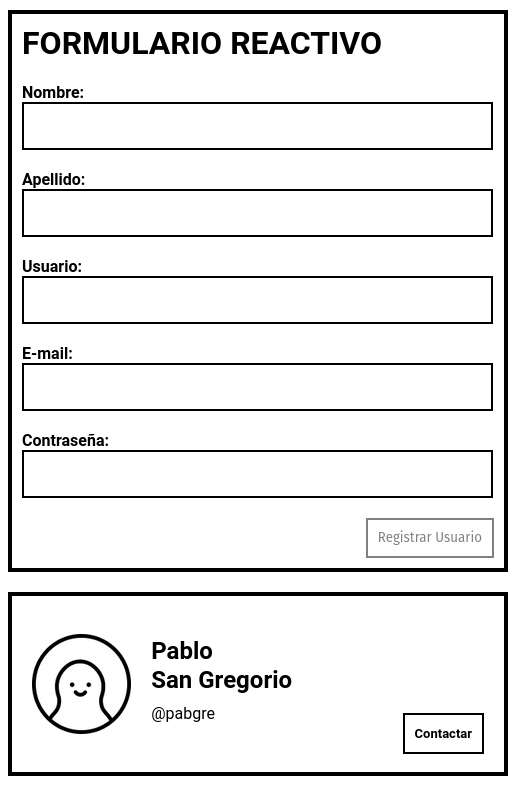

# Formulario Reactivo con Angular

Para probarlo en local es necesario ejecutar los siguientes comandos:

`ng serve --open`: Para que el servidor de desarrollo de Angular escuche en en el puerto **localhost:4200**

`npm run server`: Para que el módulo **json-server** pueda aceptar solicitudes **http** desde el puerto **localhost:5000**

